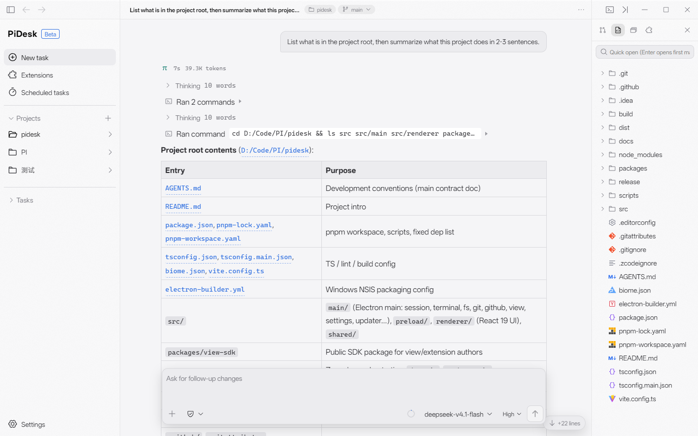
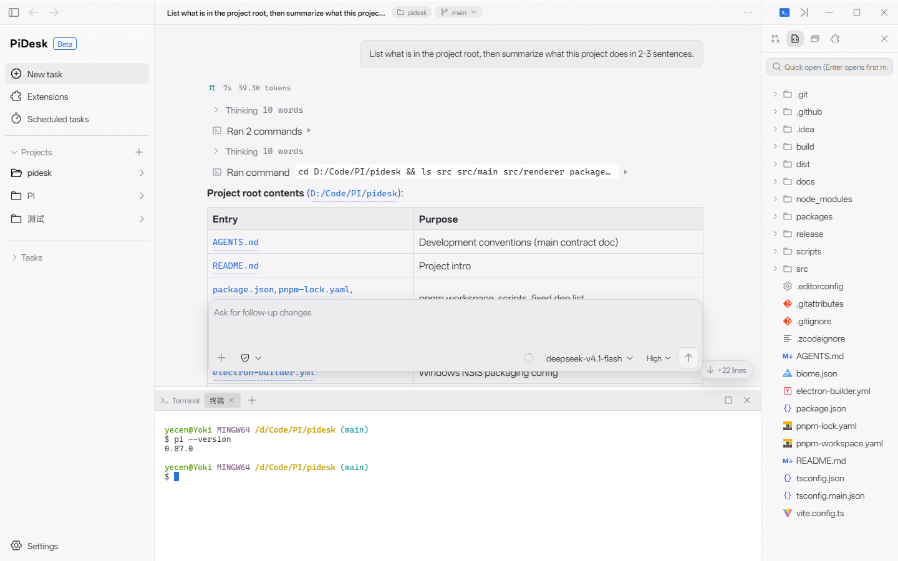
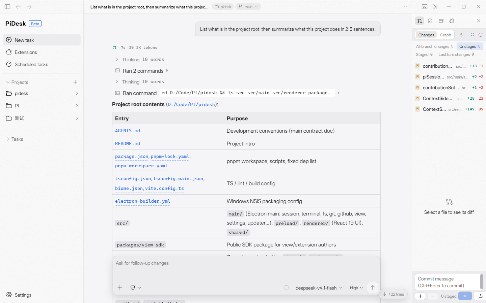
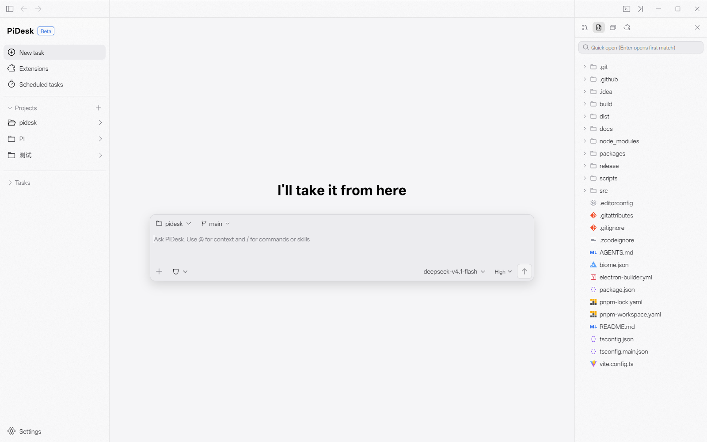

<div align="center">

# PiDesk

**A Windows desktop client for [pi](https://github.com/earendil-works/pi)** · **[pi](https://github.com/earendil-works/pi) 的 Windows 桌面客户端**

[](https://github.com/yokii89/PiDesk/releases)


[](./LICENSE)



*Session area: document-flow Markdown replies · tool-call summaries · file panel*

**English** ｜ [简体中文](#简体中文)

</div>

<a id="english"></a>

PiDesk runs pi as a `--mode rpc` child process (JSONL over stdio) and wraps it in a desktop workbench built with Electron + React 19 + TypeScript. Session history stays in pi's native JSONL files — PiDesk keeps no store of its own.

### Features

- **Session area** — streaming AI replies rendered as document-flow Markdown (no chat bubbles); tool calls as compact status rows with collapsible group summaries; collapsed thinking blocks; up to 8 parallel pi processes; archived chats; `@` file references, image and file attachments; a question rail for jumping between turns; access modes (full access / plan, extensible via the SDK)
- **Panels** — file tree with Shiki-highlighted read-only preview; multi-tab node-pty + xterm terminal bound to the project cwd; embedded Chromium with cookie login import, element picking into the conversation, live style editing and inspector; git-based review panel with diff and commit
- **Extensions** — manage pi packages; **MCP server management** with config editing, status probing and hot reload into running sessions, plus an MCP market with official registry search and curated one-click templates; in-conversation rendering of `mcp__*` tool calls; the **Extension View SDK** (`@pidesk/view-sdk`) exposes a serializable View protocol with 8 placement slots (modal / stream / widget / panel / sidebar / header / settings / access-mode), requiring zero changes to pi; scheduled tasks; usage statistics
- **Desktop** — zh-CN / en-US, light & dark themes, system tray, Windows toasts and per-scenario sounds, GitHub login with settings sync, in-app auto-update

### Getting started

Download the NSIS installer from [Releases](https://github.com/yokii89/PiDesk/releases), install the [pi](https://github.com/earendil-works/pi) CLI, point PiDesk at the pi executable, and start a task.

For development (Windows 10/11, Node.js ≥ 20, pnpm):

```bash
pnpm install             # add pnpm run rebuild:native if node-pty needs an Electron ABI rebuild
pnpm dev                 # tsc-compiled main process + Vite HMR renderer, auto-restarting Electron
pnpm dist                # Windows NSIS installer + SHA-256 checksums into release/
```

Pushing a `v*` tag triggers GitHub Actions to build and publish to Releases.

### Architecture

| Directory | Role |
| --- | --- |
| `src/main` | Electron main process: pi RPC driver, terminal pty, embedded browser, window & settings |
| `src/preload` | `contextBridge` whitelisted API (`window.pidesk`) |
| `src/renderer` | React 19 UI: session area, panels, settings, extension view host |
| `src/shared` | IPC protocol, i18n message tables, shared types |
| `packages/view-sdk` | Client SDK for extensions (published as `@pidesk/view-sdk`) |

### Docs

- [AGENTS.md](./AGENTS.md) — development conventions and tech stack
- [packages/view-sdk/README.md](./packages/view-sdk/README.md) — full View SDK reference

### License

PiDesk is released under the [MIT License](./LICENSE). Third-party assets keep their own licenses — see [src/renderer/fileIcons/NOTICE.md](./src/renderer/fileIcons/NOTICE.md) for the JetBrains icon set (Apache 2.0).

---

<a id="简体中文"></a>

<div align="center">

## 简体中文

**[pi](https://github.com/earendil-works/pi) 的 Windows 桌面客户端**


*中央会话区：文档流 Markdown 回复 · 工具调用摘要 · 右侧文件面板*

</div>

## 这是什么

PiDesk 把开源 coding agent [pi](https://github.com/earendil-works/pi) 装进一个现代桌面工作台：pi 以 `--mode rpc` 子进程运行，PiDesk 通过 JSONL over stdio 驱动它，并提供了完全自研的会话 UI、终端、文件、浏览器与扩展生态。**会话历史始终是 pi 原生的 JSONL 文件**，PiDesk 不自建会话存储，终端里的 pi 与 PiDesk 里的 pi 是同一份数据。

## ✨ 功能特性

**中央会话区**

- 流式渲染的 AI 回复一律走**文档流 Markdown**（GFM 表格、代码块一键复制），不用聊天气泡
- 工具调用渲染为紧凑状态行，连续调用自动折叠成「Ran 2 commands」式摘要头；思考（thinking）内容默认折叠成一行
- **多会话并行**：默认最多 8 个 pi 进程同时存活，切换不杀进程；支持会话归档（Archived chats）
- **@ 文件引用**（原子化 token + 只读文件芯片）、**图片粘贴/拖放**、**任意文件附件**
- 问题导航分段栏（每条提问一个跳转锚点）、上下文用量提示、消息复制/重发
- 访问模式：完全访问 / 计划模式，且可由扩展通过 SDK 注册自定义模式

**工作台面板**

- **文件**：项目文件树 + Shiki 语法高亮只读预览 + 模糊搜索快速打开
- **终端**：node-pty + xterm 独立终端，多 Tab 实例，cwd 跟随当前项目
- **浏览器**：内嵌 Chromium，登录态（Cookie）导入、元素拾取入会话、样式热更改与检查器浮窗
- **审查**：基于 git working tree 的变更列表、diff 视图与提交

|  |  |
| :---: | :---: |
| **终端 + 会话 + 文件** | **Git 审查** |

**扩展生态**

- 扩展页管理 pi packages：安装 / 卸载 / 启停
- **MCP 服务器**：左侧面板集中管理——配置增删改、状态探测、会话热重载；MCP 市场支持官方注册表搜索与精选清单一键预填；会话区承接 `mcp__*` 工具调用与结果展示
- **Extension View SDK**（`@pidesk/view-sdk`）：可序列化 View 协议，8 种挂载槽位（`modal` / `stream` / `widget` / `panel` / `sidebar` / `header` / `settings` / `access-mode`），pi 本体零改动，宿主能力协商 + 软降级
- 定时任务、用量统计（汇总卡片 + 按天/按月趋势 + 按模型明细）

**桌面体验**

- 中英双语界面、亮暗主题、自定义标题栏、系统托盘
- Windows 桌面通知与分场景提示音、GitHub 登录与设置 Gist 同步、应用内自动更新（GitHub Releases）

## 📦 下载安装

从 [Releases](https://github.com/yokii89/PiDesk/releases) 下载 NSIS 安装包（附 SHA-256 校验和）。

首次使用：

1. 本机安装 [pi](https://github.com/earendil-works/pi) CLI（模型鉴权由 pi 自身配置承担，PiDesk 无账号体系）；
2. 启动 PiDesk，在设置中指定 pi 可执行文件路径、选择工作目录；
3. 新建任务，开始对话。



## 🛠 本地开发

前置要求：Windows 10/11 · Node.js ≥ 20 · [pnpm](https://pnpm.io)（版本由 `packageManager` 字段锁定）· pi CLI

```bash
pnpm install             # 安装依赖（node-pty 需要时先跑 pnpm run rebuild:native）
pnpm dev                 # 一条命令：tsc 编译主进程 + Vite HMR 渲染层 + 自动重启 Electron
pnpm dist                # 产出 Windows NSIS 安装包与 SHA-256 校验和（release/）
```

- `pnpm dev` 覆盖三层热更新：`src/renderer` 走 Vite HMR，`src/main` / `src/preload` / `src/shared` 变更后自动重编译并重启 Electron
- 推送 `v*` tag 时，GitHub Actions 自动构建并发布到 Releases

## 🧱 架构一览

| 目录 | 职责 |
| --- | --- |
| `src/main` | Electron 主进程：pi RPC 驱动、终端 pty、内嵌浏览器、窗口与设置 |
| `src/preload` | `contextBridge` 白名单 API（`window.pidesk`） |
| `src/renderer` | React 19 界面：会话区、面板、设置、扩展 View 宿主 |
| `src/shared` | IPC 协议、i18n 文案表、共享类型 |
| `packages/view-sdk` | 扩展端 SDK（发布为 `@pidesk/view-sdk`） |

主/渲染通信统一走 `ipcMain.handle`（请求-响应）与 `webContents.send`（推送），渲染进程无 Node 能力；会话推送为约 32ms 合批的事件流，渲染层按 `sessionId` 路由。

## 📚 文档

- [AGENTS.md](./AGENTS.md) —— 开发约定与技术栈（含中央会话区渲染规则）
- [packages/view-sdk/README.md](./packages/view-sdk/README.md) —— View SDK 完整参考（挂载槽位、生命周期、限额）

## 🧰 常用脚本

| 脚本 | 说明 |
| --- | --- |
| `pnpm dev` | 开发态：渲染层 HMR + 主进程热重启 |
| `pnpm dev:renderer` | 只起 Vite dev server（纯浏览器调试渲染层） |
| `pnpm build` / `pnpm start` | 构建产物并以产物启动 |
| `pnpm dist` / `pnpm release` | 打 NSIS 包 / bump+tag 触发 CI 发版 |
| `pnpm sync:public` | 把 main 快照同步到公开镜像仓库 [Pi-Agent-Desktop](https://github.com/yokii89/Pi-Agent-Desktop)（`-- --tag x.y.z` 可同时在镜像上发版） |
| `pnpm typecheck` / `pnpm lint` | tsc strict 检查 / Biome 格式化与 Lint |
| `pnpm test:view` | view-sdk 与主进程协议逻辑测试 |
| `pnpm test:sdk:coverage` | view-sdk 行/分支覆盖率 |

## 📄 开源协议

PiDesk 以 [MIT](./LICENSE) 协议开源。仓库内第三方资产沿用其自身许可：文件类型图标源自 [vscode-jetbrains-icon-theme](https://github.com/peakoss/vscode-jetbrains-icon-theme)（JetBrains Design Resources，Apache 2.0），许可见 [src/renderer/fileIcons/NOTICE.md](./src/renderer/fileIcons/NOTICE.md)。
